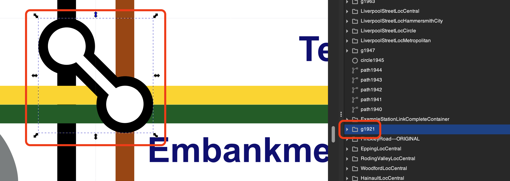
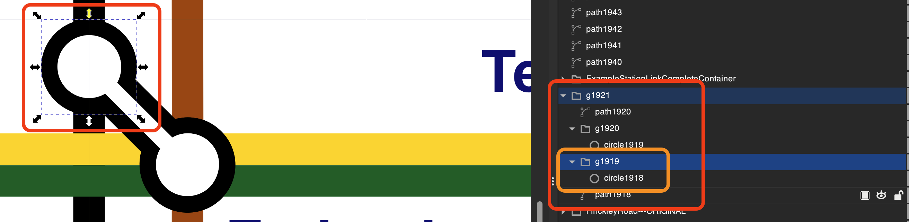
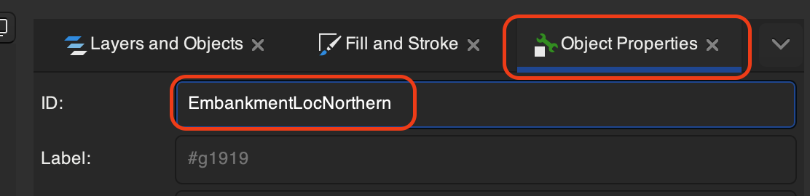
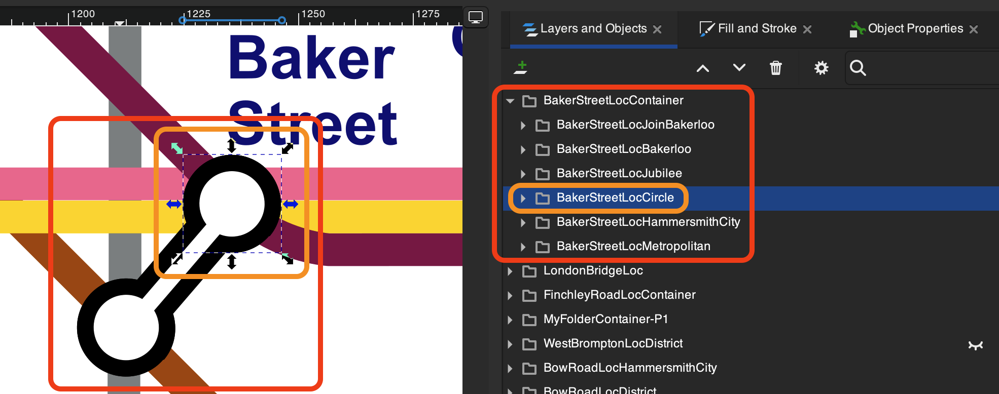

# LUPO

## Sound creation

### Samples

Instrument notes samples are stored in `public/samples/<instrument>_samples`.
Each instrument has its own folder.
Each samples is an `mp3` file.

**INSERT IMAGE OF FILE STRUCTURE HERE - snapshot taken**

### Samplers

The `audioStartup.js` file creates the samplers one by one.
In the original LUPO, it created samplers whether they would be used or not and then recreated all of them whenever the instrument set changed.

This leaves some obvious choices:

1. Create all samplers at the beginning and keep them in memory.
2. Create samplers only when they are needed and destroy them when they are not.
3. Create samplers only when they are needed and keep them in memory in case they are needed again.

For the time being, I will create all samplers at the beginning and keep them in memory.

## Code Journeys in LUPO

### Audio setup

**NOTE:** IN this current version of LUPO, the audio setup has been separated from the fetching if TfL data.

Due to browser restrictions, audio can only be played after a user interaction. In the orginal app, there was a landing page and then, once on the main page, the user would need to click on the `tap-in` button to start the audio context. Unfortunately, theis meant that none of the background working, e.g. setting up the instrument samplers, could be done prior to the main page loading.

In this version, the audio setup begins as soon as any part of the landing page is clicked. If any part of the landing page is clicked before the link to the main page, then all the audio setup will have been done by the time the main page is loaded.

_LandingPage.jsx_

```javascript
<div onClick={initialSoundSetup} className="landing-page">
```

_App.jsx_

```javascript
const initialSoundSetup = () => {
  setAudioContext(true);
};
```

`initialSoundSetup` is a function in `App.jsx` that is called when the landing page is clicked. It sets `audioContext` to `true` which in turns sets of a `useEffect` in `App.jsx` that sets up the audio context.

```javascript
useEffect(() => {
  if (audioContext) loadInstrumentSet(currentInstrumentSet);
}, [audioContext]);
```

`loadInstrumentSet` is a function in `App.jsx` that calls the `audioStartup` function in `audioStartup.js` and sets `instrumentSet` to the returned `awaitedInstruments` value. The function currently returns an object containing `awaitedInstruments` and `samplersObject` (all of the samples in a JS object).

```javascript
const loadInstrumentSet = async (instrumentSet) => {
  const awaitedInstruments = await audioStartup(instrumentSet);
  setInstrumentSet(awaitedInstruments);
};
```

### Initial TfL Data Fetch

## SVG Map

The SVG map in the original LUPO was taken from the internet and adapted for use in a CRA React app. This was hard to work with in many ways but did the job well enough. The same map did not work in this Vite React version of LUPO and multiple attempts, following a variety of tutorials failed to get the map to work as an SVG file. The many online adapters to make a React component from an SVG file also failed, possibly due to the size and complexity of the map file.

The solution came exploring turning SVG files in to React components using SVGR, possibly from [this video](https://github.com/pablisch/svg-experiment), though I am not sure  of this. Wherever the solution came from, my own solution is detailed in my [svg-experiment repo](https://github.com/pablisch/svg-experiment) which details the process.

**NOTE:** I use this to convert my SVG files as described in the `Quick Start` section of the README.

### Map editing

For use in the LUPO app, the map SVG requires considerable editing. 
- All station names need to have IDs that match the names of the station as it is after processing the TfL data.
- All lines (tracks and station markers) need to be identified for fading in and out realtive to volume.
- All links between stations with multiple station markers need to be identified and dealt with in terms of volume and fading in and out.

This is an ongoing process but so far, all map editing has been done in Inkscape by manually finding required element and renaming them at the path or group level.



_Selecting an element in Inkscape highlights its position in the file structure and vice versa._



_You can then use the file structure to view sub-elements._



_In 'Object properties', the ID and label can be changed and then 'set'._

Since it is the SVG file that is edited in Inkscape, all SVG editing must be completed before the SVG file is converted to a React component. In this instance, I am expecting to add classNames to manage the fading in and out of elements. I am not certain that this will be necessary but all SVG editing **must** be completed before the conversion.

#### Station label, location, tracks and links naming

The overall convention used here is naming in PascalCase with all punctuation and spaces removed. This follows the pattern of processing the TfL data so that any names are easily matchable with `stationName` and `lineName` in the data.

`Baker Street` becomes `BakerStreet`. 
`King's Cross St. Pancras` becomes `KingsCrossStPancras`.
`Harrow-on-the-Hill` becomes `HarrowOnTheHill`.

`Bakerloo` remains `Bakerloo`.
`Hammersmith & City` becomes `HammersmithCity`.

From that starting point, the following naming conventions are used:
- Station name lables are simply the station name, e.g. `BakerStreet`.
- Station locations are the station name followed by `Loc` and the line, e.g. `BakerStreetLocBakerloo`.
- Joins between stations are named with the station name followed by `LocJoin` and the connected train line that comes first alphabetically, e.g. `BakerStreetLocJoinBakerloo`.
- Directories containing station locations are named with the station name followed by `Stations`, e.g. `BakerlooStations`.
- Directories containing train lines, currently including station marker tabs, are named with the line name followed by `Tracks`, e.g. `BakerlooTracks`.
  
**NOTE:** It is likely that some tabs will be moved to a separate directory so that they appear over correctly layered.

##### Station name edge cases

- `Edgware Road` becomes `EdgwareRoad` but there are two stations with this name. The Circle, District and Hammersmith & City lines station is `EdgwareRoad` and the Bakerloo line station is `EdgwareRoadBakerloo`. This is the only station with a line name appended to it. This is dealt with in `processTubeData.js` in the `abridgeData` function where, if the station name includes `Edgware Road` and the line is `Bakerloo`, the station name is changed to `EdgwareRoadBakerloo`.
- `Victoria` is a station and a line. This had to be dealt with in the original app but in this version, the station name is `Victoria`, the station locations are, e.g. `VictoriaLocDistrict`, and the line is `victoriaTracks`.

##### Dealing with layering with station links

The links between stations are currently stored in the same directory as the station locations for round station markers. They take the first alphabetical line they serve and should be higher in the element list than any station that they belong to so they appear at a higher level than the station marker.

**Notable exceptions:** whilst the joining links must appear over the top or the common circle station location markers, the disabled station location markers must appear over the top of the joining links. A separate set of station directories has been created for this purpose, e.g. `BakerlooStationsFore`, and all disabled station location markers are stored here.

#### Lines

The basic lines as they are grouped in the natural SVG file and named by line appended with 'Track', e.g. `Bakerloo` is `BakerlooTrack` and `Hammersmith & City` is `HammersmithCityTracks`. These are then used to fade in and out the lines as required.

The lines are naturally contained in a group directory in the SVG file making it relatively easy to deal with these. Some line sections are in the wrong places and needed or need to be moved and there there are additional complications.
- Some station locations colour tabs are stored with the line that they overlap rather than the line that they belong to. These need to be separated out and stored in a suitable location. The issue here is which appears at a higher level so that they are displayed correctly.
- Station location markers other than the coloured tabs are not currently linked to the lines that they belong to. This should be simple to deal with where it is a single line but there are multiplt possible solutions in more complex cases where a single station location serves multiple lines.

#### Mulitple line stations and linked stations

These need to be constructed manually with a separe station marker for each line being used for that station. In terms of the links between stations, it is currently uncertain how to deal with this. Ideally, the joining links would exist each for one line and be processed dynaically but this is both a lot of work and complex for such a simple and small feature of the app. Pragmatically, I may assign each link to a single line using it and the fading in and out be linked soley to that one line. This may produce undesirable results in certain edge cases but is not currently a major concern.



_Baker Street is an example of a multiple line station with a link between station locations._

In the example above, the joining link is currently assigned to the Bakerloo line. It will fade with the Bakerloo line and not with the other lines though the mechanism for this is currently uncertain. It may use `className`s or have elements grouped in a certain way and using an `id`.


